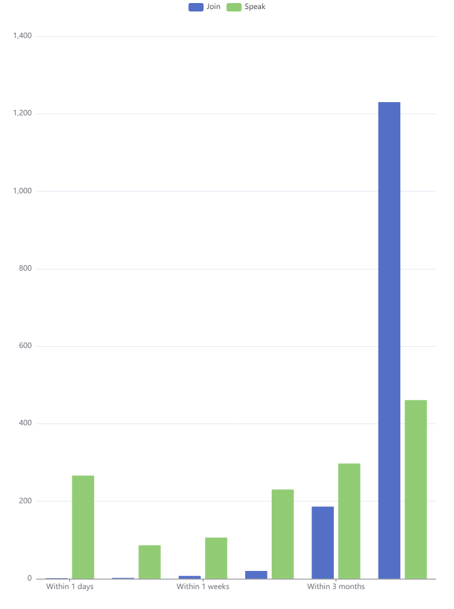

# [Mirai Selenium Plugin](https://github.com/cssxsh/mirai-selenium-plugin)

> Mirai Selenium 前置插件

Mirai-Console的前置插件，用于使用Selenium调用浏览器进行截图等

[](https://search.maven.org/artifact/xyz.cssxsh.mirai/mirai-selenium-plugin)
[](https://github.com/cssxsh/mirai-selenium-plugin/actions/workflows/setup.yml)
[](https://www.codacy.com/gh/cssxsh/mirai-selenium-plugin/dashboard?utm_source=github.com&amp;utm_medium=referral&amp;utm_content=cssxsh/mirai-selenium-plugin&amp;utm_campaign=Badge_Grade)

## 运行平台支持

|   OS    | Browser | Driver | Setup |
|:-------:|:-------:|:------:|:-----:|
| Windows | Chrome  |  Yes   |  Yes  |
| Windows | Firefox |  Yes   |  Yes  |
| Windows |  Edge   |  Yes   |   ~   |
|  Linux  | Chrome  |  Yes   |  Yes  |
|  Linux  | Firefox |  Yes   |  Yes  |
|  MacOS  | Chrome  |  Yes   |  Yes  |
|  MacOS  | Firefox |  Yes   |  Yes  |

在 `Linux` 下以 `headless` 模式运行时, 请安装 `Xvfb` 或其他虚拟窗口服务 [#8](https://github.com/cssxsh/mirai-selenium-plugin/issues/8)  
可以通过 `xvfb-run -h` 测试是否已经安装

## 在插件项目中引用

```kotlin
repositories {
    mavenCentral()
}

dependencies {
    compileOnly("xyz.cssxsh.mirai:mirai-selenium-plugin:${version}")
}

mirai {
    jvmTarget = JavaVersion.VERSION_11
}
```

### 示例代码

*   [kotlin](src/test/kotlin/xyz/cssxsh/mirai/test/MiraiSeleniumPluginTest.kt)
*   [java](src/test/java/xyz/cssxsh/mirai/test/MiraiSeleniumPluginJavaTest.java)

## 使用本前置插件的项目

*   [BiliBili Helper](https://github.com/cssxsh/bilibili-helper)
*   [GitHub Helper](https://github.com/gnuf0rce/github-helper)

## 管理指令

*   `/selenium setup` 安装驱动文件
*   `/selenium clear` 清理驱动文件
*   `/selenium destroy` 清理驱动进程
*   `/selenium status` 驱动进程状态
*   `/selenium firefox` 下载解压 firefox
*   `/selenium chromium` 下载解压 chromium
*   `/selenium chrome` 下载解压 chrome
*   `/selenium chart` 测试 图表绘制功能，将以群员入群事件和发言时间为数据集

## 配置

### [MiraiSeleniumConfig.yml](src/main/kotlin/xyz/cssxsh/mirai/selenium/data/MiraiSeleniumConfig.kt)

*   `expires` 驱动文件过期时间，默认一星期 (单位：天)
*   `user_agent` 浏览器 UA
*   `width` 浏览器宽度
*   `height` 浏览器高度
*   `pixel_ratio` 浏览器像素比
*   `headless` 无头模式（后台模式）
*   `proxy` 代理地址
*   `log` 启用日志文件
*   `browser` 指定使用的浏览器: `Chrome`,`Chromium`,`Firefox`,`Edge`
*   `factory` 指定使用的Factory: `netty` （ktor 不再可用）
*   `arguments` 自定义 arguments, 可以尝试加入 `--no-sandbox`, `--disable-dev-shm-usage`, 解决兼容性问题
*   `preferences` 自定义 preferences，浏览器配置

### [MiraiBrowserConfig.yml](src/main/kotlin/xyz/cssxsh/mirai/selenium/data/MiraiBrowserConfig.kt)

*   `chrome` Chrome/Chromium 二进制文件路径
*   `edge` Edge 二进制文件路径
*   `firefox` Firefox 二进制文件路径

## [MiraiSeleniumLoginSolver](src/main/kotlin/xyz/cssxsh/mirai/selenium/MiraiSeleniumLoginSolver.kt)

本插件提供了 一个类似 [mirai-login-solver-selenium](https://github.com/project-mirai/mirai-login-solver-selenium) 的 登陆处理器  
需要在 mirai 运行时中添加 JVM 属性 mirai.slider.captcha.supported (添加参数 -Dmirai.slider.captcha.supported) 启用

## [ECharts](src/main/kotlin/xyz/cssxsh/selenium/ECharts.kt)

`v2.2.2` 提供了方便调用 [ECharts](https://echarts.apache.org/) 进行表格绘制的工具类, 使用方法详见示例代码  
`/selenium chart` 测试结果示例  


## 安装

### MCL 指令安装

**请确认 mcl.jar 的版本是 2.1.0+**  
`./mcl --update-package xyz.cssxsh.mirai:mirai-selenium-plugin --channel maven-stable --type plugin`

### 手动安装

1.  从 [Releases](https://github.com/cssxsh/mirai-selenium-plugin/releases) 或者 [Maven](https://repo1.maven.org/maven2/xyz/cssxsh/mirai/mirai-selenium-plugin/) 下载 `mirai2.jar`
2.  将其放入 `plugins` 文件夹中

## [爱发电](https://afdian.net/@cssxsh)

